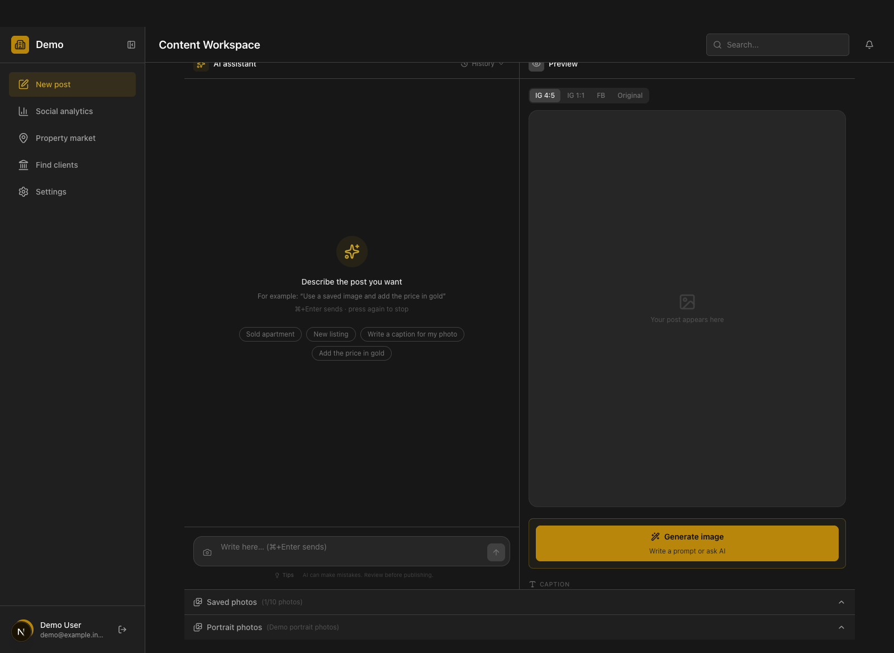
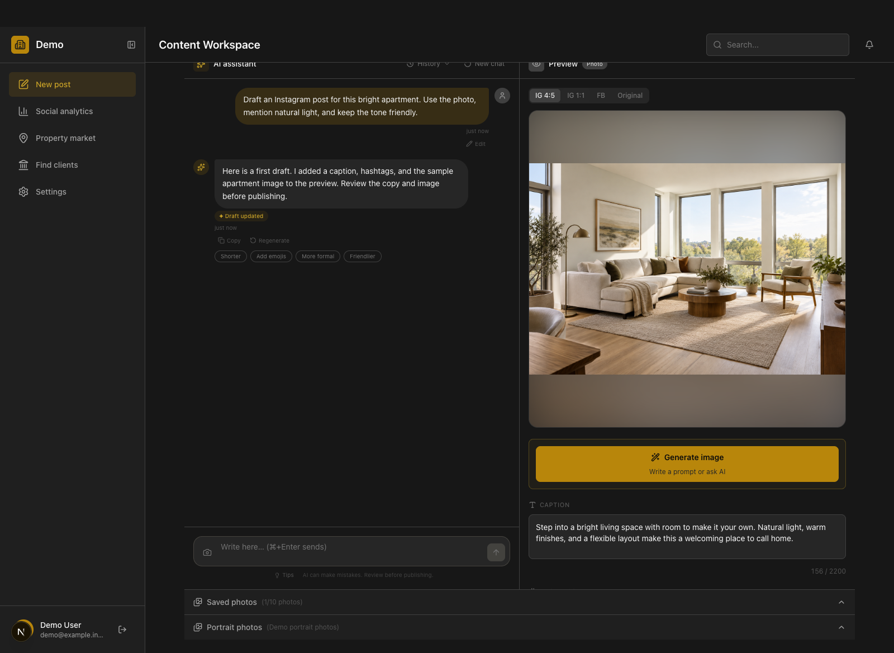
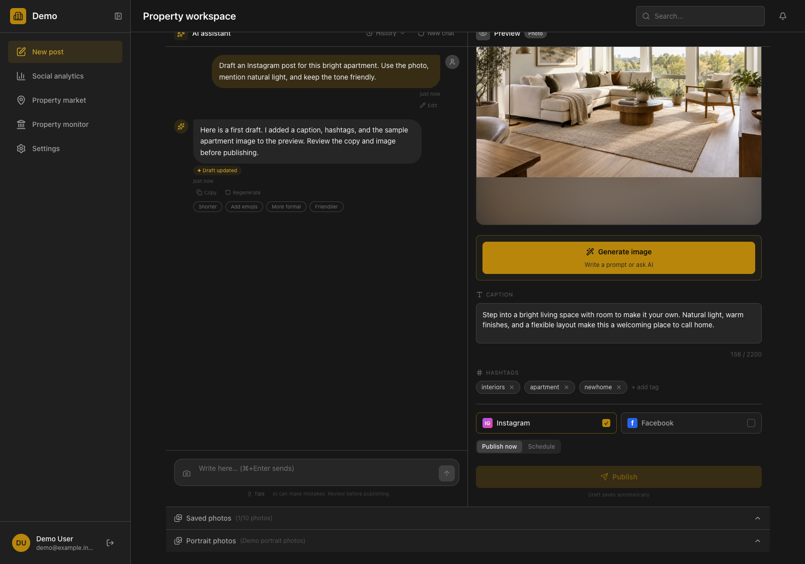
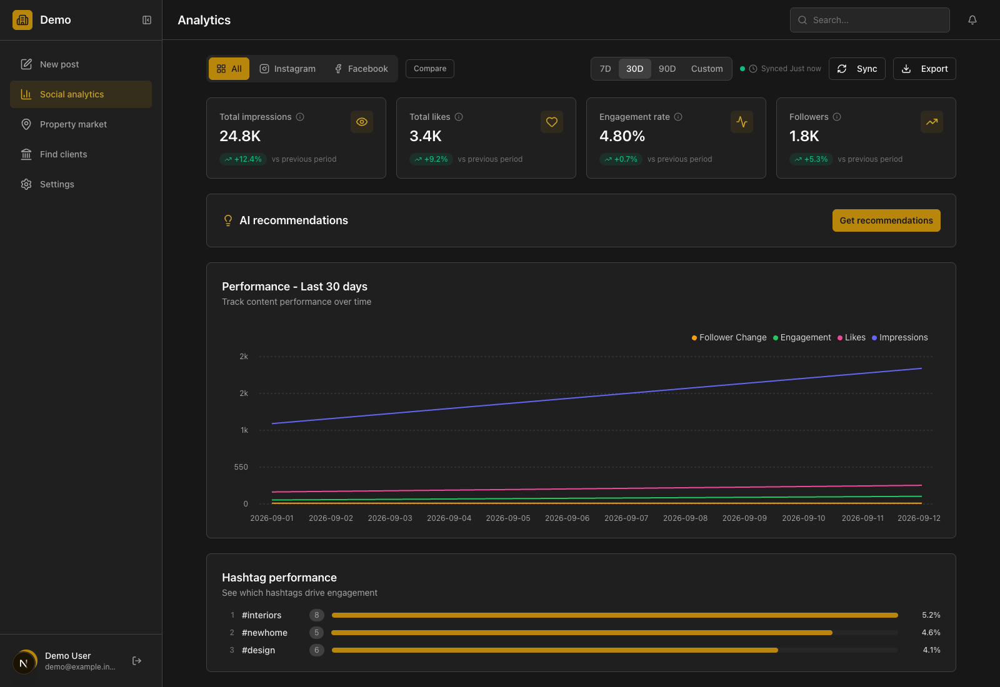
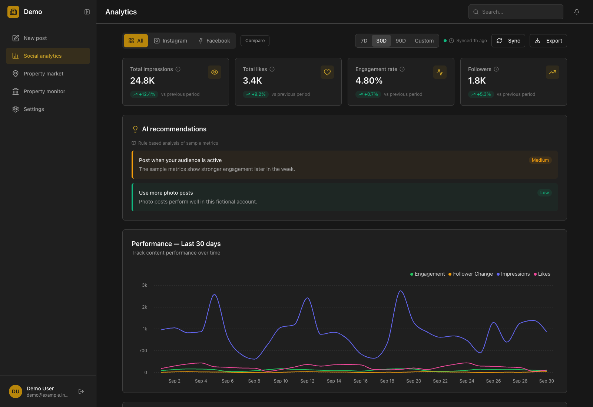
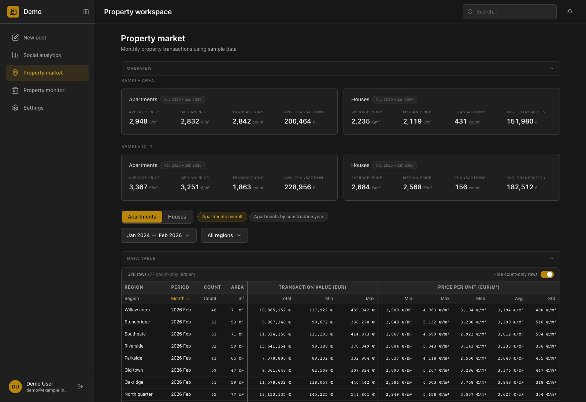

# Property insights and content workspace

I worked on a private web app for property market analysis, real-estate monitoring, social analytics, and AI-assisted content drafting. This public case study shows selected parts of the interface without publishing the application or any connected account data.

## What I built

- A post editor with chat, saved photos, a live image preview, editable captions and hashtags, and publish and schedule controls.
- An analytics view with account metrics, time filters, charts, hashtag performance, and recommendations.
- A property market view with summary cards, filters, tables, charts, and a data coverage display. The coverage display separates months with price data from months with transaction counts only.

The private codebase includes a Meta Graph API client and a rule-based recommendation fallback. The publishing service in this version uses a mock queue, so the controls shown below do not demonstrate live publishing.

## Post editor

The first image shows the empty editor. The next two show a request to draft a post, the chat response, the updated photo preview, and the editable copy and publishing controls.







## Analytics

The analytics view combines summary metrics, a performance chart, and hashtag results. A second capture shows recommendation cards based on the sample metrics.





## Property market

The market view shows summary cards and filters. The coverage display shows which area and month combinations have prices, transaction counts only, or no data.




## How these images were made

I rendered the private app's React components and styles in an isolated local copy. I changed the visible labels to English for these captures and replaced the brand and user details with demo labels. The app received fictional API responses. The chat exchange was simulated through the app's chat response route and draft update action, so it shows how the interface handles a reply rather than proving a live AI call. The [apartment photo](visuals/mock-apartment.png) is generated mock content. No real posts, customers, accounts, or market records appear here.

## A small code example

[`examples/coverage.mjs`](examples/coverage.mjs) adapts one idea from the market data view. For each area and month, it reports whether a price exists, only a transaction count exists, or neither exists. It uses invented areas and values and is not the private app's source code or data model.

Run its tests with Node.js:

```bash
node --test examples/coverage.test.mjs
```

The application source, credentials, connected accounts, and real content remain private.
