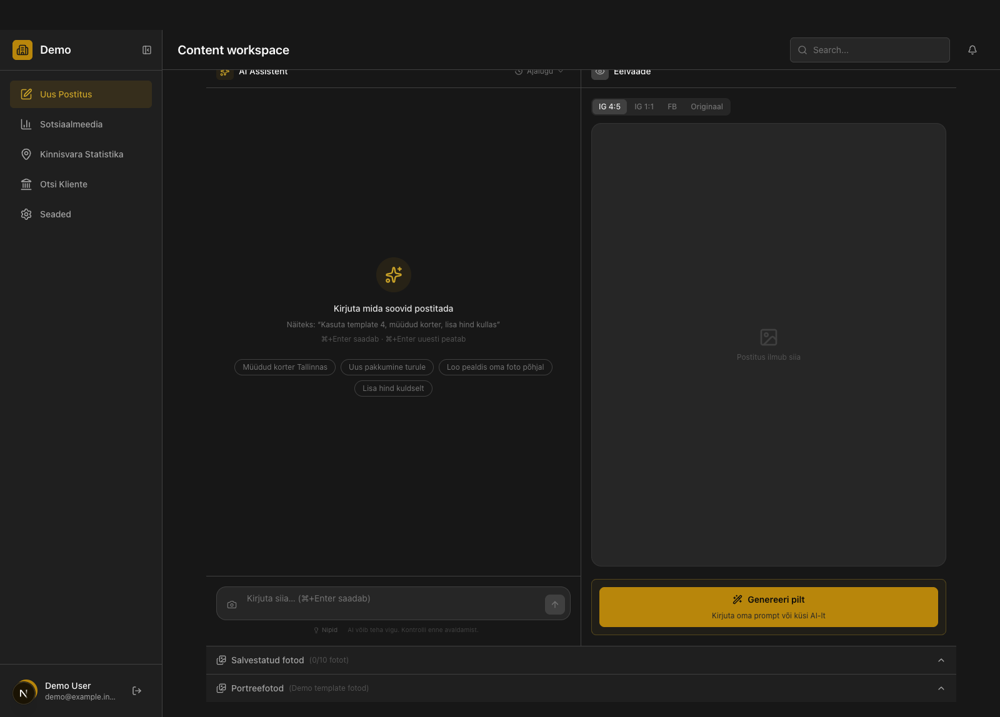

# Social content workspace

A private web app I worked on to bring social account reporting and post drafting into one place. This public repository explains the work without publishing the application, connected accounts, or real content.

## The problem

The work combined two recurring tasks. Someone managing social content needed to review account performance and prepare a post with images and copy. The app also brought property market data into the same workspace so market information could inform content decisions.

## What I built

- An analytics view for account and post metrics. It includes time filters, performance charts, audience data, and comparisons across content types. The private codebase has a Meta Graph API client and a rule-based recommendation fallback.
- A post drafting workspace with a chat panel, saved images, an editable preview, caption and hashtag controls, and explicit user actions before image generation.
- A market data view with filters, tables, charts, and a coverage display. The coverage display distinguishes months with price data from months with only transaction counts. That distinction keeps missing prices visible.

The application is private. These descriptions come from the implementation, not a claim about production use or measured business results. The post editor contains a publishing interface, but the publishing service in this version uses a mock queue. I do not present it as live automated publishing.

## Interface



This is the post editor rendered from the private app's React components and styles. I captured its empty state in an isolated local copy. I replaced the brand and user details with demo labels and disconnected the account and photo libraries. No real posts or account data appear in the image. The earlier hand-drawn screens were inaccurate and have been removed.

## A small code example

[`examples/coverage.mjs`](examples/coverage.mjs) is an adapted version of one idea from the market data view. For each area and month, it reports whether a price exists, only a transaction count exists, or neither exists. The example uses invented areas and values. It is not the private app's full source or data model.

Run the example's tests with Node.js:

```bash
node --test examples/coverage.test.mjs
```

## Scope

The repo contains this case study, one screenshot of the real editor with demo details, and one runnable example. It does not contain the private application, its Git history, credentials, customer data, account names, or real posts.
