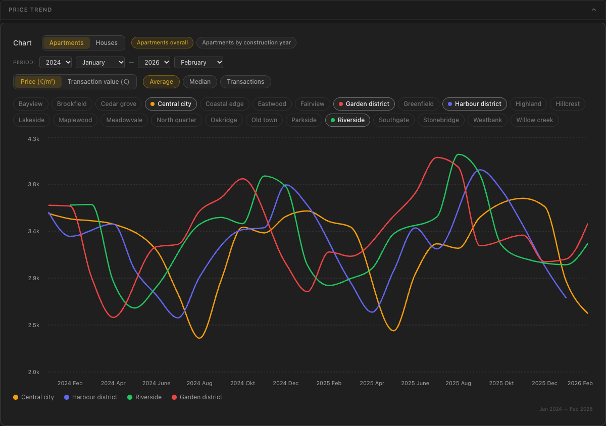
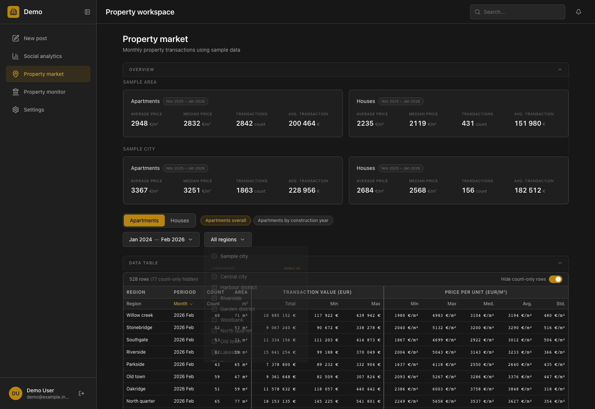
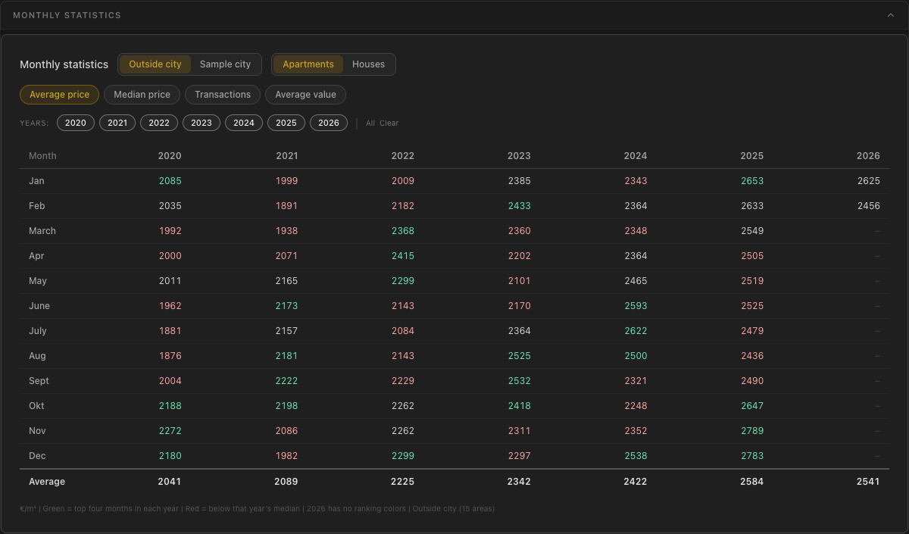
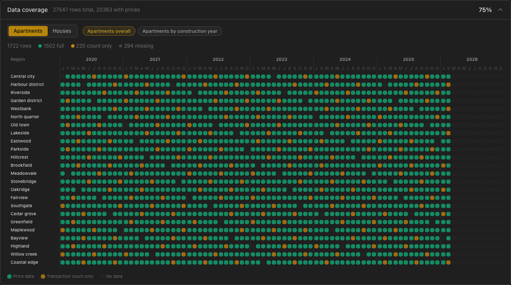
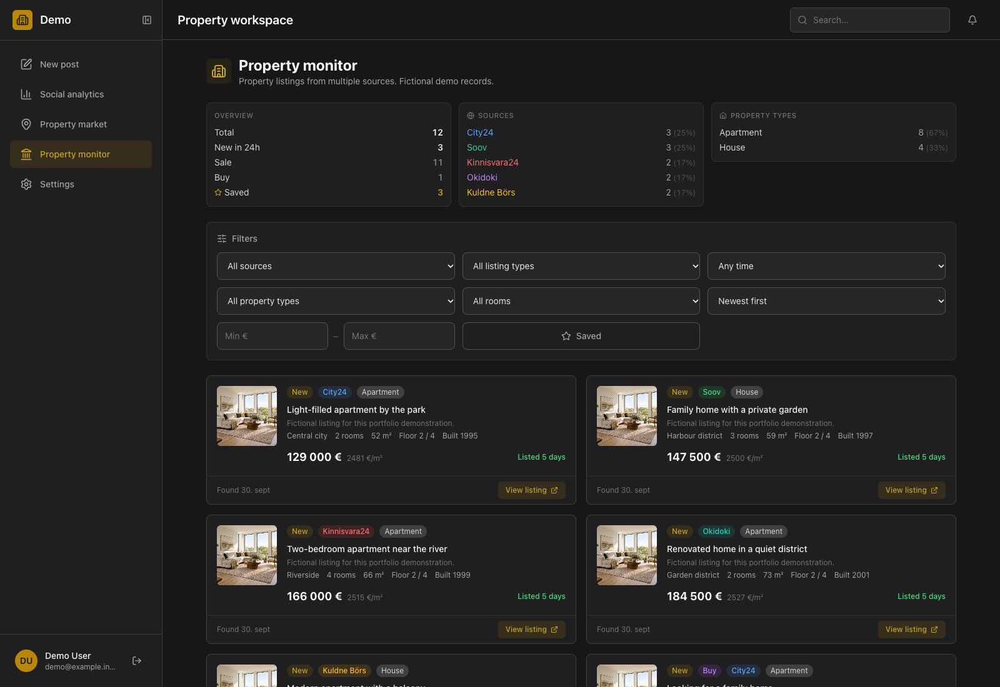
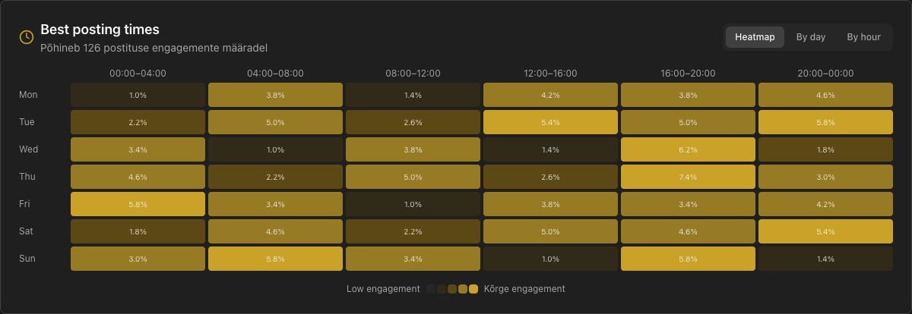
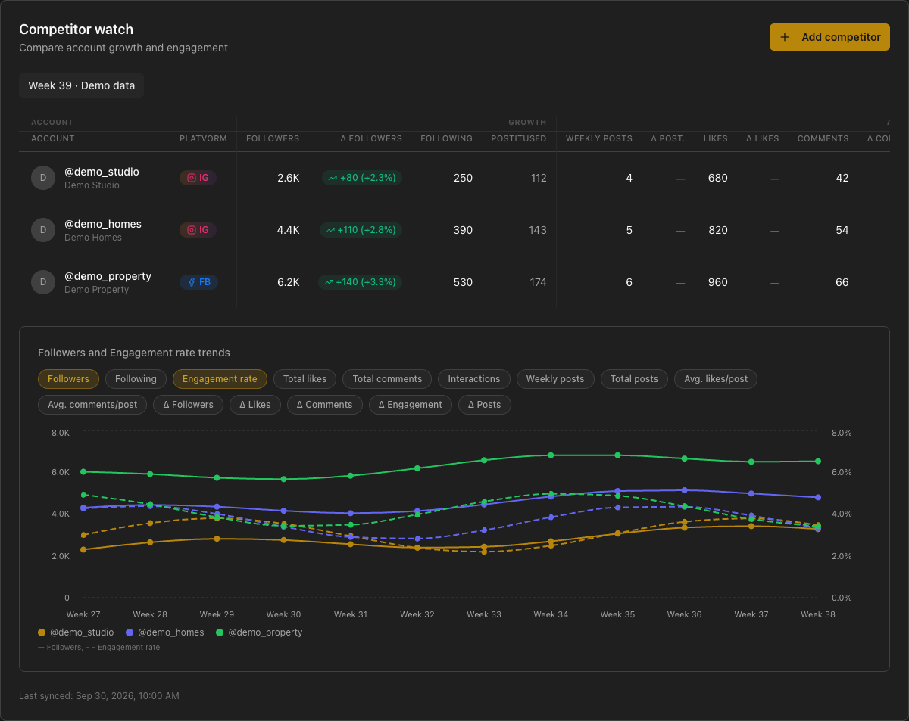
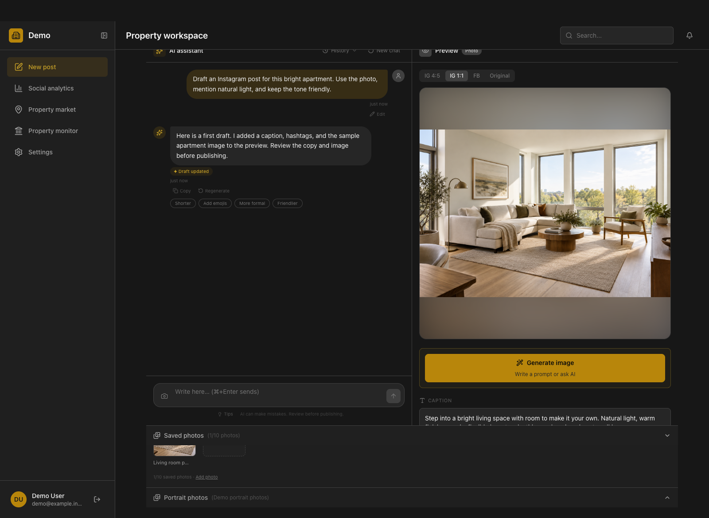

# Feature tour

[Back to the case study](../README.md)

All values, area names, account details, and listing content in this tour are fictional. The market fixture contains 27,547 records across 24 areas and five report categories. Its history runs from January 2020 to February 2026. Counts in the captures describe this fixture, not the private database.

## Market controls

| Component | Controls and behavior |
| --- | --- |
| Table filters | Apartments or houses; overall or construction-year reports for apartments; type, material, or construction-year reports for houses; start and end month/year; grouped region multi-selection; subcategory selection when applicable |
| Numeric table | Sort by region, period, subcategory, transaction count, area, transaction-value fields, or price fields; show or hide count-only rows |
| Trend chart | Its own property, report, and date filters; average or median price; transaction count; total, minimum, or maximum transaction value |
| Comparison mode | Compare selected regions for a category, or compare subcategories in a single region; selecting house reports and apartment age reports makes the category view available |
| Region ranking | Apartments or houses; average price, median price, transaction count, or average transaction value; select a year and then one or several months; clear months to use the annual aggregate |
| Monthly statistics | City or outlying-area scope; apartments or houses; four metrics; toggle individual years or select all; yearly averages for price/value and yearly totals for counts |
| Coverage | Property and report selectors; price, count-only, and missing states by region/year/month; row totals and price-coverage percentage |
| Section layout | Collapse or expand overview, table, trend, ranking, and monthly sections; section state persists in localStorage |

The table and charts fetch separately. The overview uses a fixed period in this version, while the table and chart controls support their own selected periods. The selected period appears within the corresponding view.

The coverage percentage measures cells with prices. A transaction count alone does not establish that price information exists. Category-level row counts can exceed the number of region-month cells because categories contain multiple subcategories.

### Price comparisons

Four selected areas have distinct seasonal changes, peaks, dips, and occasional gaps. The capture's price axis uses data-dependent bounds so the differences remain readable. Transaction-count and total-value captures retain a zero baseline.

[Transaction counts](../visuals/market-transactions.png) · [Apartment construction periods](../visuals/market-age-comparison.png) · [House types](../visuals/market-house-types.png) · [House materials](../visuals/market-house-materials.png) · [House construction periods](../visuals/market-house-age.png) · [Transaction values](../visuals/market-value.png)

### Filters and detailed records

[Date selection](../visuals/market-date-filters.png) · [Single-area result](../visuals/market-filtered.png) · [Table with count-only rows visible](../visuals/market-table.png)

### Rankings, monthly views, and coverage

[Price ranking](../visuals/market-region-comparison.png) · [Annual transaction ranking](../visuals/market-region-transactions.png) · [Monthly transaction totals](../visuals/market-monthly-transactions.png)

## Property monitor

The interface supports source, sale/purchase, listing-age, property-type, room, and price filters. Sorting options include newest first, price, price per square metre, and longest listed. Saved items have a separate filter. Selection state appears in the URL, so a user can retain a particular view.

The demonstration includes invented listing cards from the supported source labels. Their external links use a reserved invalid domain. It does not demonstrate a live scrape or a successful visit to a source listing.

[Saved view](../visuals/property-saved.png)

## Social analytics

| View | Capability |
| --- | --- |
| Dashboard filters | All platforms, Instagram, or Facebook; 7, 30, or 90 days; custom dates; previous-period comparison |
| Performance | Impressions, likes, engagement, follower change, hashtags, and posting frequency |
| Post records | Top posts and a sortable post-metric table |
| Audience | Age/gender breakdown, countries, and cities |
| Stories | Story totals and average reach, impressions, and replies; individual-story support in the component |
| Posting times | Day/hour engagement heatmap, daily bars, and hour-group bars |
| Competitors | Account table, growth deltas, weekly metrics, selectable chart metrics, and separate axes when percentage and count metrics are combined |
| Recommendations | Rule-based fallback and AI recommendation integration in the private codebase |

These captures exercise the three posting-time views, competitor metric selection, and the recommendation response. Other controls are documented from the components. They do not establish live Meta synchronization, AI recommendations, or export success.

[Daily view](../visuals/analytics-by-day.png) · [Hourly view](../visuals/analytics-by-hour.png) · [Audience](../visuals/analytics-audience.png) · [Story summary](../visuals/analytics-stories.png) · [Post metrics](../visuals/analytics-posts.png)

## Content editor

The chat and preview panels share a draft. A structured chat response can update its caption, hashtags, image, content type, and selected platforms. The captures simulate that response through the interface's stream handling and draft-update action.

| Area | Capability or current limit |
| --- | --- |
| Chat | Conversation history, new conversation, response actions, and draft updates |
| Caption | Editable copy, character count, and a 2,200-character limit |
| Hashtags | Editable chips with removal and addition controls; up to 30 tags |
| Preview | Instagram 4:5 and 1:1, Facebook, and original image ratio |
| Libraries | Reusable saved photos and a separate portrait-template library |
| Image workflows | Upload and generation controls; image-generation and compositing services in the private codebase |
| Platforms | Instagram and Facebook selection |
| Publishing | Mock service; disabled button in the captured editor |
| Scheduling | Panel opens, but date/time inputs are disabled |
| Autosave | Hint is present; the hint alone is not proof of implemented persistence |

[4:5 preview](../visuals/editor-portrait.png) · [Caption and hashtag controls](../visuals/draft-controls.png) · [Scheduling panel](../visuals/editor-schedule.png)

## Capture checks

The local capture used the application's components with English labels, shortened long control labels, fictional response fixtures, and adjusted price-axis bounds. External network requests were blocked. The public images contain no real account, customer, listing, or market records.

The exercised market flows include region selection, property/report changes, metric changes, year selection, monthly scope changes, selecting all years, opening coverage, and revealing count-only table records. The region filter reduced the initial visible table from 528 priced rows to 23 priced rows for one area. The saved-listing filter changed the URL and displayed only the three saved fixture records. The editor stream action updated the preview and draft; format and scheduling controls were exercised.

These checks establish the demonstration's rendered behavior. Production data freshness, the database's current size, live external services, authentication, and successful publishing were not checked. A phone-sized overview was inspected, but the gallery focuses on desktop views; the wide analytical tables need horizontal scrolling on smaller screens.
